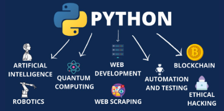
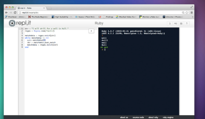
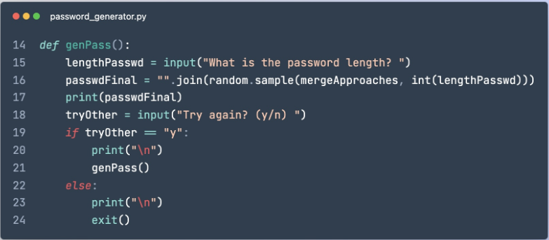

- [1. Introducción](#1-introducción)
  - [El lenguaje Python](#el-lenguaje-python)
  - [Herramientas](#herramientas)
  - [Instrucciones](#instrucciones)
  - [Nombres de archivos](#nombres-de-archivos)
  - [Comentarios](#comentarios)
- [2. Print e input](#2-print-e-input)
  - [Print](#print)
  - [Input](#input)
- [3. Variables](#3-variables)
  - [Declarar una variable](#declarar-una-variable)
  - [Asignación](#asignación)
  - [Ámbito](#ámbito)
- [4. Operadores](#4-operadores)
  - [Operadores aritméticos](#operadores-aritméticos)
  - [Orden de operaciones](#orden-de-operaciones)
  - [Operadores de asignación](#operadores-de-asignación)
  - [Operadores lógicos](#operadores-lógicos)
- [5. Condicionales](#5-condicionales)
  - [Partes de un condicional](#partes-de-un-condicional)
  - [If](#if)
  - [Elif](#elif)
  - [Else](#else)
- [6. Bucles](#6-bucles)
  - [Bucle `while`](#bucle-while)
  - [Bucle `for`](#bucle-for)
  - [Break y continue](#break-y-continue)
    - [Break](#break)
    - [Continue](#continue)
- [7. Funciones](#7-funciones)
  - [Devolver valores](#devolver-valores)
- [8. Librerías, módulos o bibliotecas](#8-librerías-módulos-o-bibliotecas)
  - [¿Qué son las bibliotecas?](#qué-son-las-bibliotecas)
  - [Importar](#importar)
  - [Instalación de una biblioteca](#instalación-de-una-biblioteca)
  - [Usar una biblioteca](#usar-una-biblioteca)
- [9. Archivos](#9-archivos)
  - [Leer un archivo](#leer-un-archivo)
  - [Leer línea por línea](#leer-línea-por-línea)
  - [Eliminar un archivo](#eliminar-un-archivo)
  - [Escribir en un archivo](#escribir-en-un-archivo)
  - [Agregar información a un archivo](#agregar-información-a-un-archivo)
- [10. Listas](#10-listas)
  - [Crear una Lista](#crear-una-lista)
  - [Agregar elementos a una lista](#agregar-elementos-a-una-lista)
  - [Acceder a elementos de una lista](#acceder-a-elementos-de-una-lista)
  - [Iterar sobre una lista](#iterar-sobre-una-lista)
  - [Longitud de una lista](#longitud-de-una-lista)
  - [Eliminar elementos de una lista](#eliminar-elementos-de-una-lista)
  - [Ordenar](#ordenar)
- [11.Manejo de Errores en Python](#11manejo-de-errores-en-python)
  - [Errores de Sintaxis](#errores-de-sintaxis)
  - [Excepciones](#excepciones)
  - [Try and Except](#try-and-except)
  - [Finally](#finally)
- [12. Programación orientada a objetos](#12-programación-orientada-a-objetos)
  - [Objetos y clases](#objetos-y-clases)
  - [Clase](#clase)
  - [Crear una clase](#crear-una-clase)
  - [Objetos](#objetos)
  - [Ejemplo con pokemon](#ejemplo-con-pokemon)

Mis apuntes de python

# 1. Introducción

## El lenguaje Python

Existen muchos lenguajes de programación, que son como diferentes idiomas. Cada uno tiene unas palabras propias y una determinada forma de escribirse, y se utilizan para tareas muy variadas. Nosotros vamos a aprender a utilizar **Python**, uno de los lenguajes más populares, pero hay muchos más.



## Herramientas

**Herramientas online**

Para crear nuestros programas vamos a usar un entorno de programación online.En nuestro caso, [Repl.it](http://www.repl.it) donde podéis crear programas utilizando cualquier lenguaje a través de un navegador sin necesidad de instalar nada, y todos los proyectos que hagáis se guardarán ahí automáticamente.



**Herramientas de desarrollo (IDE)**

El más habitual es Visual studio code.


## Instrucciones

Un programa es conjunto de una o más **instrucciones**. Cada instrucción ocupa una línea, y dichas listas están numeradas. De esta forma es fácil localizarlas y encontrar errores.



## Nombres de archivos

- Se guardan con extensión ``.py``
- Nombre escritos en ``minúsculas``
- Utilizar ``guiones bajos`` para separar palabras o números

Ejemplos:

- operaciones_3_2.py
- operaciones_masa_corporal.py

## Comentarios

El comentario es una línea de texto que se usa para explicar el código
y proporcionar información útil para aquellos que están leyendo el código.

```python
# Esto es un ejemplo de un comentario en python
```

Si lo hacemos así, tendremos que comentar línea a línea:

```python
# Esto se conoce como un comentario de línea única,
# ya que solo se usa una línea para escribir un comentario.
```

También podemos comentar un bloque de varias líneas:

```python
"""
Esto se conoce como un comentario de bloque,
ya que se usan varias líneas para escribir un comentario.
"""
```

Los comentarios en python también se pueden usar para deshabilitar código temporalmente.
Por ejemplo, aquí estamos deshabilitando la línea de código a continuación:

```python
# print("Hola Mundo")
```

# 2. Print e input

## Print

La función `print()` se encarga de imprimir por pantalla. Sirve para informar al usuario, mostrar resultados o darle instrucciones.

Por ejemplo:

```python
print("hola que tal")
```
Podemos concatenar cadenas de caracteres.
```python
print("hola","que tal")
print("hola"+ "dani")
```
## Input
La función `input()` nos permite introducir información a través del teclado.
Podemos utilizarlo sin indicar nada entre paréntesis:

```python
print("introduce tu nombre")
input()
```
Si escribimos dentro de los paréntesis, podemos mostrar información antes de escribir:
```python
input("introduce tu nombre")
```

# 3. Variables

Las variables nos permiten guardar en ellas información. Hay muchos tipos de variables:

- **Enteros**: 5
- **Cadenas de texto**: "Dani"
- **Booleanos**: True, False

Las variables tienen un nombre que las identifica. Por ejemplo:

```python
Edad = 20
Nombre = "Dani"
vivo = True
```
## Declarar una variable

Para poder usar una variable, hay que declarla antes. Es decir, hay que nombrarla y asignarle un valor para que así exista y podamos hacer referencia a ella.

```python
nombre = "Dani"
print(nombre)
nombre = "Pepe"
```

## Asignación

El signo igual asigna un valor a la variable. Podemos cambiar el valor que tiene nuestra variable en cualquier momento.

Un ejemplo completo:

```python
nombre = input("dime tu nombre")
print(nombre)
```
Si queremos convertir el resultado de un input en un número utilizamos la función `int()`. Por ejemplo:

```python
edad = int(input("dime tu edad"))
print(edad+5)
```

## Ámbito

Una variable solo existe y se puede usar en el bloque en el que ha sido declarada. Es decir, en el siguiente ejemplo:

- nombre se puede usar en cualquier lugar del programa
- apellido solo puede usarse dentrol del if, y no funcionará fuera de él.

```python
nombre = "dani"
print(nombre)
if nombre == "dani":
    apellido = "martinez"
    print("Hola Dani")

```

# 4. Operadores

Python ofrece muchas herramientas para realizar operaciones matemáticas y lógicas. Estas herramientas se conocen como **operadores** y permiten realizar **cálculos, comparaciones y manipulaciones** de variables.

En este apartado veremos:

- operadores aritméticos
- operadores de asignación
- operadores lógicos

## Operadores aritméticos

Los operadores aritméticos permiten realizar operaciones matemáticas básicas como sumar, restar, multiplicar y dividir.

**Suma**

La suma se puede realizar usando el operador `+`. Por ejemplo:

```python
a = 3
b = 4
c = a + b
print(c) # imprime 7
```

Del mismo modo:

- La resta se puede realizar usando el operador `-`.
- La multiplicación se puede realizar usando el operador `*`.
- La división se puede realizar usando el operador `/`.

**Módulo**

El módulo se puede realizar usando el operador `%`. Por ejemplo:

```python
a = 7
b = 4
c = a % b
print(c) # imprime 3
```

## Orden de operaciones

Para las operaciones hay un orden de prevalencia, como en las matemáticas comunes, por lo cual debes tener cuidado y usar paréntesis, así como asegurarte de que lo que escribes funciona como deseas.

```python
print (3+4*2)
```
En este ejemplo, la multiplicación se hará en primer lugar, y después la suma.

## Operadores de asignación

Los operadores de asignación permiten asignar un valor a una variable.

**Asignación**

La asignación se puede realizar usando el operador `=`. Por ejemplo:

```python
a = 3
print(a) # imprime 3
```

**Adición**

La adición se puede realizar usando el operador `+=`. Por ejemplo:

```python
a = 3
a += 5
print(a) # imprime 8
```
Del mismo modo:

- La sustracción se puede realizar usando el operador `-=`.
- La multiplicación se puede realizar usando el operador `*=`.
- La división se puede realizar usando el operador `/=`.

## Operadores lógicos

Los operadores lógicos permiten realizar comparaciones entre variables y devolver un valor booleano. Estos valores nos permiten tomar decisiones en ciertos momentos de nuestro programa.

Una variable booleana puede tener dos valores:

- ``False``
- ``True``

**Igualdad y desigualdad**

La igualdad se puede comprobar usando el operador `==`. La desigualdad se puede comprobar usando el operador `!=`.

```python
a = 3
b = 4
c = (a == b)
print(c) # imprime False
d = (a != b)
print(d) # imprime True
```

**Mayor que**

La comparación mayor que se puede comprobar usando el operador `>`. Por ejemplo:

```python
a = 3
b = 4
c = (a > b)
print(c) # imprime False
```

Del mismo modo:

- La comparación menor que se puede comprobar usando el operador `<`.
- La comparación mayor o igual que se puede comprobar usando el operador `>=`.
- La comparación menor o igual que se puede comprobar usando el operador `<=`.

**Concatenación**

El operador + permite concatenar cadenas de caracteres.

```python
cadena1 = "Hola"
cadena2 = "mundo"
cadena3 = cadena1 + " " + cadena2
print(cadena3)
```

**Partes de una cadena**

También podemos obtener partes de un string. Para ello utilizaremos [ ]. Si dentro colocamos un número, nos dará la letra que ocupa esa posición.

```python
cadena1 = "Pikachu"
print(cadena1[0])
```

En informática, comenzamos a contar por el 0. Por lo tanto, la D ocupará la posición 0, y la a la posición 1, etc.

# 5. Condicionales

Los condicionales son una parte importante de la programación, ya que nos permiten controlar el flujo de nuestro programa. Estos nos permiten ejecutar un código si una condición es verdadera o ejecutar un código diferente si la condición es falsa.

En Python, hay tres tipos principales de condicionales: if, elif y else.

## Partes de un condicional

Un condicional tiene tres “partes”.

1. La condición que queremos comprobar (en este caso edad>18)
2. Las acciones que tomamos si se cumple la condición (nos dirá que somos viejos)
3. Las acciones que tomamos si NO se cumple la condición (dirá que somos jóvenes)

## If

El condicional if es el más básico de los condicionales. Si una condición es verdadera, se ejecutará el código que sigue al condicional.

```python
if condicion:
    codigo
```

Por ejemplo, si queremos comprobar si un número es mayor que 10, podemos usar el siguiente código:

```python
numero = 5
if numero > 10:
    print("El número es mayor que 10")
```

En este caso, la condición es falsa, por lo que el código no se ejecutará.

## Elif

Elif es una palabra clave que significa "si la condición anterior fue falsa, entonces prueba esta condición". Esto nos permite comprobar múltiples condiciones y ejecutar diferentes códigos dependiendo de la condición.

```python
numero = 5
if numero > 10:
    print("El número es mayor que 10")
elif numero == 5:
    print("El número es 5")
```

En este caso, la primera condición es falsa, por lo que el código no se ejecutará. Sin embargo, la segunda condición es verdadera, por lo que el código después del elif se ejecutará.

## Else

Else es una palabra clave que significa "si ninguna de las condiciones anteriores fue verdadera, entonces ejecuta este código". Esto es útil si queremos ejecutar un código si ninguna de nuestras condiciones fue verdadera.

```python
numero = 5
if numero > 10:
    print("El número es mayor que 10")
elif numero == 5:
    print("El número es 5")
else:
    print("El número es menor que 10")
```

En este caso, ninguna de las condiciones anteriores fue verdadera, por lo que el código después del else se ejecutará.

# 6. Bucles

Los bucles son una herramienta muy útil cuando deseamos ejecutar una secuencia de comandos una y otra vez hasta que una condición de parada se cumpla. En Python hay dos bucles principales: el bucle `while` y el bucle `for`.

## Bucle `while`

El bucle `while` se ejecutará mientras una condición dada sea verdadera. Veamos un ejemplo sencillo.

```python
# Inicializamos la variable contador en 0
contador = 0

# El bucle se ejecutará mientras contador sea menor a 5
while contador < 5:
    print(contador)
    contador += 1
```

En este ejemplo, el bucle `while` se ejecutará mientras la variable `contador` sea menor a 5. Cada vez que el bucle se ejecuta, el valor de la variable `contador` aumenta en 1, hasta llegar a 5. Una vez que el valor de `contador` llega a 5, la condición de parada se cumple y el bucle se detiene.

Un caso especial que podríamos estudiar es un bucle ``while True``. Esto hará que el bucle se repita indefinidamente, a menos que salgamos del programa.

```python
while True:
    print("Este bucle no termina nunca")
```

## Bucle `for`

El bucle `for` se utiliza para iterar sobre los elementos de una secuencia (por ejemplo, una lista, una tupla, un diccionario, etc.). Veamos un ejemplo.

```python
# Creamos una lista con los números del 1 al 5
numeros = [1, 2, 3, 4, 5]

# El bucle se ejecutará para cada elemento de la lista
for numero in numeros:
    print(numero)
```

En este ejemplo, el bucle `for` se ejecutará para cada elemento de la lista `numeros`. En cada iteración del bucle, el elemento actual de la lista se asignará a la variable `numero` y será impreso. Una vez que se hayan iterado sobre todos los elementos de la lista, el bucle se detendrá automáticamente.

## Break y continue

Python nos ofrece dos palabras clave para controlar el flujo de un bucle: `break` y `continue`.

### Break

`break` se utiliza para romper un bucle en cualquier momento, incluso si la condición de bucle todavía se cumple. Esto significa que el código restante dentro del bucle no se ejecutará.

Ejemplo:

```python
for i in range(10):
    if i == 5:
        break
    print(i)
```

En este ejemplo, se imprimirán los números del 0 al 4. Una vez que `i` es igual a 5, el bucle se rompe y el resto de la iteración no se ejecutará.

### Continue

`continue` se utiliza para saltar la iteración actual de un bucle y continuar con la siguiente.

Ejemplo:

```python
for i in range(10):
    if i == 5:
        continue
    print(i)
```

En este ejemplo, se imprimirán los números del 0 al 9, excepto el 5. Una vez que `i` es igual a 5, se salta la iteración actual y el código restante dentro de la iteración no se ejecuta.

# 7. Funciones

Las funciones nos permiten guardar un bloque de código con un nombre para llamarlas cuando queramos. Las funciones terminan en paréntesis: `sumar()`,`jugar()`, etc.

Las funciones son una forma de organizar el código y las tareas en Python. Para crear una función:

Se usa la palabra clave ``def`` seguida por el nombre de la función y los parámetros entre paréntesis.

```python
def calcular (numero1, numero2):
```

A continuación, el bloque de instrucciones que contendrá nuestra función:

```python
def calcular (numero1, numero2):
    numero3 = numero1 + numero2
    numero3 = numero3*3
```

La siguiente línea que no esté identada, marcará el final de la función:

```python
def calcular (numero1, numero2):
    numero3 = numero1 + numero2
    numero3 = numero3*3
print("esto ya no está en la función")
```

Para llamar a la función, únicamente utilizamos el nombre, y pasamos el valor correspondiente a las variables que necesite:

```python
calcular(4,5)
```

## Devolver valores

Si no lo indicamos, nuestras funciones realizan las acciones que tienen dentro, pero no devuelven ningún valor. Sin embargo, podemos hacer que nos devuelva algún valor al terminar utilizando ``return``.

Ejemplo:

```python
def precio_con_iva (precio):
  preciofinal = precio*(1 + 0.21)
  return preciofinal
```
De esta forma, la función al terminar nos devolverá el contenido de la variable ``preciofinal``. Podríamos asignar este valor devuelto a otra variable si queremos:

```python
def precio_con_iva (precio):
  preciofinal = precio*(1 + 0.21)
  return preciofinal

total = precio_con_iva(30)
```

# 8. Librerías, módulos o bibliotecas

Las **bibliotecas** de Python son recursos de código que se pueden utilizar para realizar tareas específicas. Estas bibliotecas de código se almacenan en un directorio llamado "librería". E

## ¿Qué son las bibliotecas?

Una **biblioteca** es una colección de archivos de código que pueden ser usados ​​para realizar tareas específicas. Estas bibliotecas contienen código que se ha escrito con antelación para hacer que sea fácil realizar ciertas tareas. Por ejemplo, una biblioteca puede contener código que le permite crear gráficos o leer archivos de datos.

## Importar

Algunas bibliotecas como ``math``, ``statistics``, etc. vienen instaladas por defecto con Python. Para usarlas, se hace utilizando la función de Python `import`. Por ejemplo, para cargar la biblioteca `math`, puede usar el siguiente código:

```python
import math
```

A continuación, cuando queramos utilizar una función de esta biblioteca, podemos usar su nombre y, seguido de punto, la función u objeto a utilizar.

```python
import math
math.sqrt(20)
```

## Instalación de una biblioteca

Otras bibliotecas, primero debes **instalarlas**. La forma de instalar una biblioteca depende de la biblioteca en particular. Algunas bibliotecas se pueden instalar utilizando el gestor de paquetes de Python, **pip**. Otras bibliotecas se pueden instalar descargando el código fuente y compilándolo.

Por ejemplo, para instalar ``pygame``, como no viene incluída de serie con Python:

```bash
pip install pygame
```

## Usar una biblioteca

Una vez que haya cargado una biblioteca, puede usar el código incluido en dicha biblioteca para realizar tareas. Dependiendo de la biblioteca, esto puede implicar la creación de objetos, la llamada a funciones o el uso de clases. Por ejemplo, la biblioteca `matplotlib` contiene una clase llamada `pyplot` que le permite crear gráficos. Para usar esta clase, primero debe importarla:

```python
from matplotlib import pyplot
```

Una vez que la haya importado, puede usar la clase para crear gráficos usando el siguiente código:

```python
pyplot.plot([1, 2, 3, 4])
pyplot.show()
```

# 9. Archivos

Una vez termina nuestro programa, todos los datos se borran de la memoria del ordenador. Si queremos tenerlos disponibles, necesitamos o bien guardar nuestros datos en una base de datos, o bien en algún archivo.

Los archivos nos permiten guardar datos en nuestro ordenador de forma permanente.

## Leer un archivo

Para leer un archivo primero necesitamos abrirlo en modo lectura, usando la función `open()`:

```python
f = open("archivo.txt", "r")
```

Ahora podemos leer el archivo usando la función `read()`:

```python
text = f.read()
```

Finalmente, es importante recordar cerrar el archivo usando la función `close()`:

```python
f.close()
```

Si utilizamos “r”, abrimos el archivo en modo lectura.

```python
with open('texto.txt', 'r') as archivo:
    texto = archivo.read()
    print(texto)
```

## Leer línea por línea

También podemos ir leyendo línea por línea

```python
# Abrir el archivo
archivo = open("archivo.txt", "r")

# Leer cada línea
for linea in archivo:
    print(linea)

# Cerramos el archivo
archivo.close()
```

## Eliminar un archivo

Para borrar un archivo podemos utilizar la librería os. Para ello, al principio de nuestro archivo debemos importarla.

```python
# Eliminar un archivo llamado "test.txt"
import os
os.remove("archivo.txt")
```

Actividad: Crea un programa que te pida el nombre, tu peso y tu edad, y calcule tu índice de masa corporal (busca la fórmula). A continuación, deberá guardar esta información en una línea nueva en un archivo nuevo.

## Escribir en un archivo

Para escribir en un archivo primero necesitamos abrirlo en modo escritura, usando la función `open()`:

```python
f = open("archivo.txt", "w")
```

Ahora podemos escribir en el archivo usando la función `write()`:

```python
f.write("Esto se escribirá en el archivo")
```

Finalmente, es importante recordar cerrar el archivo usando la función `close()`:

```python
f.close()
```

Ejemplo:

```python
with open('texto.txt', 'w') as archivo:
    archivo.write("Esta es la línea 1\n")
    archivo.write("Esta es la línea 2\n")
    archivo.write("Esta es la línea 3\n")
```

## Agregar información a un archivo

```python
# abrir el archivo
with open('archivo.txt', 'a') as archivo:
    # escribir una línea
    archivo.write('Esta es una línea de texto añadida al archivo')
```

# 10. Listas

Los objetos que almacenan otros objetos se llaman ``colecciones``. Las más sencillas son las ``listas``.

Las **listas** son un tipo de dato en Python que le permite almacenar un conjunto de elementos de manera ordenada y acceder a ellos mediante un **índice**. Las listas son una de las estructuras de datos más útiles y versátiles en Python.

## Crear una Lista

Para crear una lista, use corchetes [] para encerrar una lista de elementos separados por comas. Aquí hay un ejemplo de cómo crear una lista en Python:

```python
# Crear una lista
mi_lista = [1, 2, 3, 4]
```

## Agregar elementos a una lista

Puede agregar elementos a una lista existente usando el método `.append()`:

```python
# Agregar un elemento a la lista
mi_lista.append(5)
```

## Acceder a elementos de una lista

Puede acceder a los elementos de una lista mediante su índice, que comienza en 0. Por ejemplo, para obtener el primer elemento de la lista anterior, usaríamos el siguiente código:

```python
# Obtener el primer elemento de la lista
primer_elemento = mi_lista[0]
```

Mostrar los dos primeros elementos:

```python
alumnos[2:]
```

## Iterar sobre una lista

También puedes iterar sobre los elementos de una lista usando un bucle `for`. Aquí hay un ejemplo de cómo imprimir todos los elementos de una lista:

```python
# Imprimir todos los elementos de la lista
for elemento in mi_lista:
    print(elemento)
```

## Longitud de una lista

Puede obtener el número de elementos de una lista usando la función predefinida `len()`:

```python
# Obtener la longitud de la lista
longitud = len(mi_lista)
```

## Eliminar elementos de una lista

Puede eliminar elementos de una lista usando la función predefinida `del`:

```python
# Eliminar el tercer elemento de la lista
del mi_lista[2]
```

Eliminar el último elemento:

```python
del alumnos[-1]
```

## Ordenar

Podemos ordenar a los alumnos por orden alfabético con la función ``sort()`` que tienen todas las listas:

```python
alumnos.sort()
```

# 11.Manejo de Errores en Python

En Python, hay dos tipos de errores que los programadores pueden encontrar: errores de sintaxis y excepciones.

## Errores de Sintaxis

Los errores de sintaxis ocurren cuando olvidas un símbolo o escribes algo mal, como olvidar dos puntos al final de una línea o cometer un error de ortografía en una palabra clave. Estos errores se muestran inmediatamente cuando intentas ejecutar el código y se conocen como errores de sintaxis.

## Excepciones

Las excepciones ocurren cuando hay un error en el código, pero no se produce un error de sintaxis. Por ejemplo, una excepción puede ocurrir si intentas dividir un número entre cero, ya que esto no está permitido en Python. En este caso, Python mostrará un mensaje de error especial que describe la excepción.

## Try and Except

En Python, hay una forma de manejar excepciones usando la sentencia try and except. La sentencia try and except le permite a los programadores "capturar" excepciones que ocurren en su código y proporcionar una respuesta adecuada.

Aquí hay un ejemplo de cómo se usa la sentencia try and except:

```python
try:
   # intenta ejecutar este código
   result = 10 / 0
except ZeroDivisionError:
   # si hay una excepción, se ejecuta este código
   print("No se puede dividir entre cero")
```

En este ejemplo, la sentencia try intenta ejecutar el código dentro de ella. Si hay una excepción, se salta la sentencia try y se ejecuta la sentencia except, que muestra un mensaje de error.

## Finally

En algunos casos, puede que desees que una parte de tu código se ejecute independientemente de si hay una excepción o no. Para esto, puedes usar la sentencia finally. La sentencia finally se ejecutará siempre, incluso si hay una excepción.

Aquí hay un ejemplo de cómo se usa la sentencia finally:

```python
try:
   # intenta ejecutar este código
   result = 10 / 0
except ZeroDivisionError:
   # si hay una excepción, se ejecuta este código
   print("No se puede dividir entre cero")
finally:
   # esta sentencia se ejecutará siempre
   print("Esta sentencia se ejecutará siempre")
```

# 12. Programación orientada a objetos

La Programación Orientada a Objetos (POO) es un paradigma que organiza el código alrededor de ``objetos``, que combinan datos y funcionalidad. En Python, todo es un objeto.

## Objetos y clases

- **Objetos**: Instancias de clases que encapsulan datos y funciones.
- **Clases**: Plantillas para crear objetos.

## Clase

Una **clase** define las propiedades y los comportamientos de un conjunto de objetos. Una clase es una plantilla para crear objetos.

La clase puede tener:

- **Atributos**: Características de un objeto.
- **Métodos**: Funciones asociadas a una clase.

## Crear una clase

Para crear una clase, utiliza la palabra clave ``class`` seguida del nombre de la clase. Los métodos o funciones se identifican con ``def``.

```py
class Coche:
    def __init__(self, marca, modelo):
        self.marca = marca
        self.modelo = modelo
        self.encendido = False

    def encender_apagar(self):
        self.encendido = not self.encendido
```

El método ``__init__`` es un método especial llamado **constructor** que inicializa los atributos de la clase.

Los métodos en una clase se incluyen dentro de la definición de la clase y pueden acceder a los atributos del objeto a través del parámetro ``self``.

## Objetos

Un **objeto** es una instancia de una clase. Cada objeto que creemos tendrá todas las propiedades y comportamientos definidos para su clase.

Los objetos se crean dándole un identificador y asignándole la clase correspondiente. Al indicar la clase, también pasamos los atributos que queremos que tenga.

```py
mi_coche = Coche("Toyota", "Corolla")
```

## Ejemplo con pokemon

Aquí podemos ver una **clase** pokemon que tiene:

- Tres **atributos**: nombre, tipo y nivel
- Tres **métodos**: init, atacar y subir_nivel

Todo lo que está dentro de class no se ejecuta, simplemente indica como es esta clase.

```python
class Pokemon:
    def __init__(self, nombre, tipo, nivel):
        self.nombre = nombre
        self.tipo = tipo
        self.nivel = nivel

    def atacar(self):
        print(f"{self.nombre} ha usado un ataque de {self.tipo}")

    def subir_nivel(self):
        self.nivel += 1
        print(f"{self.nombre} ha subido al nivel {self.nivel}")
```
Para crear un objeto:
```py
pikachu = Pokemon("Pikachu", "Trueno", 5)
```
Si queremos llamar a la función ``atacar()``. Recuerda que ``pikachu`` es un objeto de la clase ``pokemon``, y esta clase tiene definido un método ``atacar()``.
```py
pikachu.atacar()
```
Para acceder al atributo ``tipo``:
```py
print(pikachu.tipo)
```